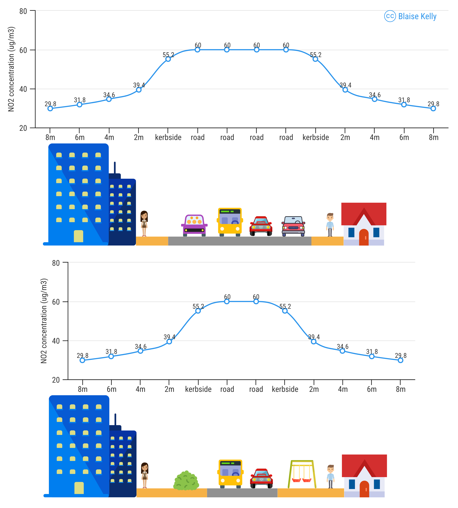

### Summary

London’s Ultra Low Emission Zone (ULEZ), introduced in central London in
April 2019 and expanded to inner London in 2021 and London-wide in 2023
(GLA 2025), cut NO2 at central London traffic sites by around
20% in its first three months (Tong et al. 2025).
<!-- Added as interesting but commented out as not relevant to main argument -->
<!-- However, the average effect across the city appears to be small [@maHasUltraLow2021] and no change in NO~2~ has been observed from the 2023 [@tongFurtherImprovement2025]. -->
<!-- Commented out this sentence as not relevant to the main argument (RL): -->
<!-- The mechanisms behind this fall are the result of legislative work that began in 2001. -->
Outside central London, there is little evidence of that ULEZ and Clean
Air Zones (CAZs) (7 of which have been implemented) in other cities have
been effective in one of the main goals: reducing NO2 levels.
Furthermore, these policies have done little to address other
collectively more serious urban issues which should also be considered
given their public health rationale.

This raises a key question: is it possible to reduce NO2
faster whilst also addressing other urban challenges that collectively
have a bigger impact on public health, including road traffic
casualties, obesity, and poor mental health? Modal shift to active modes
has great potential to tackle each of these issues, but is mostly left
out of the discussion around CAZ-type policies. Yet large co-benefits to
be found in joint active travel and air quality policies. For example,
by simply reducing road widths to free up urban space for active travel,
the source-receptor distance is increased, road traffic is constrained
and NO2 can be reduced.
<!-- Citation needed for the claim above (RL). --> Furthermore, the
reclaimed street space could support activities such as walking,
wheeling, cycling, playing and plants/trees/crops which have been shown
to have large health benefits.

This study proposes an alternative to the car modelling approach:
<!-- Citation needed to explain what the car modelling approach is (RL). -->
model the changes in air pollution exposure at the level of sensitive
receptors as a result of policies including road space reallocation
which is where the negative impacts of emissions are most felt, rather
than focusing solely on vehicle emissions.

### Background

Society faces severe urban environmental challenges. Cities are not only
a major driver of climate change they are extremely vulnerable to its
effects, such as sea level rise and extreme weather. 80% of the
population of developed countries live in cities and often are exposed
to environmental risks such as noise, air pollution (Woolf et al. 2024),
as well as road traffic collisions and soaring rates of child and adult
obesity and mental illness.

Biodiversity loss and the resulting ecosystem collapse is a serious
national security threat (Government 2026) . Road transport is
responsible for nearly 1/3 of UK’s total CO2 emissions (DESNZ
2026) which affects health, building operation (Kelly 2019b) (Fuller
2019) and climate change.

Whilst violent crime is the lowest since records began (ONS 2026), motor
vehicle traffic is the highest it has been in more than 40 years (DfT
2026a). Girls under 16 now walk on average 70 miles less per year than
they did in 2004 (DfT 2026b) Children’s play opportunities are well
below where needed.
<!-- how far did they walk each year in 2004? (RL) --> The two leading
external causes of death of children are road traffic collisions and
suicide (NCMD 2023) .

Air pollution is another major urban challenge. Air pollution policy in
the UK has historically focused on legislating vehicle emissions. The
reductions in NO2 seen in the last few years are the result
of work that began at the start of the Millennium (euractiv 2001), that
was passed in the EU in 2008 and came into effect in June 2010
(*Directive 2008/50/EC of the European Parliament and of the Council of
21 May 2008 on Ambient Air Quality and Cleaner Air for Europe* 2008) .

Cities across Europe largely failed to meet these targets (EC 2017)
because of systemic fraud by vehicle manufacturers (Jong and Linde 2022)
.

In early 2018, a 7 year legal case forced the government to take the
“fastest route to compliance” to address the exceedances (BBC 2018) .

Defra’s Joint Air Quality Unit (JAQU) decided to push for CAZs as a
narrowly-focussed solution to air quality issues (JAQU 2017). This was
despite:

- Continued uncertainty over real world vehicle emissions (Reid 2019)
- Road transport contributing \>1/5 of all CO2 emissions
  (today it is \>1/4 (DESNZ 2026))
- An acknowledgement that the world faced a climate emergency (BBC 2019)
- A study estimating switching 10% of car trips to cycling and walking
  would reduce NO2 by 5 times more than CAZs (Ballinger et
  al. 2017) as well as reducing Particulate Matter (PM), something the
  current CAZs have been poor at addressing (Parliament 2026) .

Other studies have investigated the effect of modal shift on Air Quality
by modelling changes in road emissions resulting from modelled or
measured modal shift(Matajs et al. 2026) (Mueller et al. 2020), which
fits with the focus on directly reducing emissions from the road. The
complicating factor in all these studies is the level of modal shift,
which is why active travel is often ignored as the feasibility of this
is disputed, often as a result of “motonormativity” (Walker, Tapp, and
Davis 2022).

### Hypothesis

Little attention has been paid to the potential impacts of physical
changes to urban space reducing emissions and improving air quality,
in-line with government policy. The hypothesis that will be tested
during this PhD is the following:

> Road space reallocation is a more effective strategy for reducing
> urban air pollution than simply relying on vehicle emission controls,
> both by directly reducing traffic volumes and the increases in source
> receptor distance that would follow.

NO2 levels fall with distance to source, as shown in Figure
1, which shows a calculation based on the NO2 “Fall off with
distance” calculator (Defra 2018) estimating the reduction in
NO2 concentrations at buildings if the kerb is moved 2m away
from the building on each side of the road and kerbside concentrations
remain the same.

*Figure 1 - Based on the Defra NO2 fall off with distance
calculator, increasing the distance from a road with a kerbside
concentration of 60 μg/m3 by 2 metres is estimated to drop
the concentration of NO2 at the receptor (building) from 39.4
to 34.6 μg/m3, a 14% decrease.*

The concept of traffic evaporation also supports our hypothesis. In
early 2015, road space removal as part of London’s Cycle Superhighway
build out seems to have resulted in a 20% and 23% reduction in two
roadside NO2 monitoring sites in the space of a few months
(Kelly 2019a) .

To facilitate travel during the COVID19 pandemic urban space was
reallocated in the form of Emergency “pop-up”, or tactical cycle lanes
(Schapps 2020). Despite in some cases only being movable cones these
lanes were effective and some were converted to permanent infrastructure
e.g. [Stretford in Trafford,
2021](https://www.google.com/maps/@53.4423165,-2.3118749,3a,75y,85.55h,90t/data=!3m8!1e1!3m6!1sM2ZOW26AZy1dssfn7qI7wg!2e0!5s20210101T000000!6shttps:%2F%2Fstreetviewpixels-pa.googleapis.com%2Fv1%2Fthumbnail%3Fcb_client%3Dmaps_sv.tactile%26w%3D900%26h%3D600%26pitch%3D0%26panoid%3DM2ZOW26AZy1dssfn7qI7wg%26yaw%3D85.54594382393394!7i16384!8i8192?entry=ttu&g_ep=EgoyMDI2MDkwOC4wIKXMDSoASAFQAw%3D%3D)
and [later in
2025](https://www.google.com/maps/@53.4423566,-2.3118395,3a,75y,85.55h,90t/data=!3m7!1e1!3m5!1sKw0ok_ptQrXaqveMFmWjdA!2e0!6shttps:%2F%2Fstreetviewpixels-pa.googleapis.com%2Fv1%2Fthumbnail%3Fcb_client%3Dmaps_sv.tactile%26w%3D900%26h%3D600%26pitch%3D0%26panoid%3DKw0ok_ptQrXaqveMFmWjdA%26yaw%3D85.54594382393394!7i16384!8i8192?entry=ttu&g_ep=EgoyMDI2MDkwOC4wIKXMDSoASAFQAw%3D%3D).
Studying how these affected receptor pollutant concentrations is
complicated by drastic changes in emissions from roads during this time.

Focusing on these approaches could not only improve air pollution
faster, but give cities more control than relying on engine
manufacturers as well as delivering a plethora of systems benefits that
addresses the urban emergency and also engages the public with visible
measures, such as green space to absorb rainfall and reduce heat boost
biodiversity, areas to sit/play, walking, cycling routes, space for
cafes and restaurants, to make their city more livable.

The cost of living continues to be one of the most pressing political
issues. The shifts from active to motorised modes that has happened over
the past century in most cities has had significant negative cost
implications for the public in cities, and there are potentially huge
cost savings when this trend is reversed (Hendrich et al. 2026). Whilst
public support for road pricing is generally positive, the benefits are
often only seen in official reports and statistics and they send the
message that environmental measures mean restrictions and expense
(Bretschger 2021). Manchester chose to spend money originally designated
for CAZ on other measures (Gawne 2025) such as one of the the largest
segregated cycle networks outside of London (Pidd and editor 2018).

<!-- I commented out this next sentence as not central to the main argument and not related to road space reallocation. Will the PhD focus on filtered permeability in addition to road space reallocation? One to think about but I think it's fine to focus just on road space reallocation for now (RL). -->

<!-- Cities including Barcelona which implemented ambitious "Superblocks" show that that after they are installed people quickly come around to them and would not go back. Implementing measures that people can see and understand and can save them money quickly can be politically more popular than more charges. -->

### Methods

The study will develop a dispersion model to estimate the changes in
roadside concentrations by modelling only road width changes, keeping
the emissions factor for the road the same.

Unlike research focussing on filtered neighbourhoods and the Barcelona
Superblocks, it will focus on main roads that have been deemed to be the
most polluted, those part of the Roadside Urban Air Quality Monitoring
Network sites (~350).

#### Core analysis

- Quantify urban public space in cities and the proportion given to
  roads, using LiDAR, OSM, Land registry and OS data.
- Get flow and speed data to estimate emissions from roads.
- Meteo data from ERA5 to calculate necessary meteo parameters for model
- Combine data in the US EPA’s open access AERMOD with an R interface
  (Kelly 2026) that enables domain tilling and run in parallel to model
  concentrations at sensitive receptors (locations where limit values
  apply/maybe all buildings).
- Reduce road widths in the model with minimal to aggressive approach
  but leaving road emissions the same and model concentrations at
  receptors.

#### Additional

<!-- Is this quantification based on case studies in which road space has been reallocated?
Is it based on comparing NO~2~ and PM~10~ concentrations in roads with different widths?
Clarify (RL): -->

- Quantify effect reduced road space has on traffic flows and modify
  pollutant emissions
- Apply this to CO2 emissions estimates
- Meteorological normalisation tools for removing the effect of weather
  from observation data (Grange et al. 2018)
- Tools such as DuckDB and Apache Arrow for improving efficiency of RAM
  use.

#### Outcomes

<!-- This first is the key one, should we also add something along the lines of "compared with CAZ type policies" ? -->

- Calculate impact on all applicable pollutant concentrations at
  sensitive receptors (NO2, PM10,
  PM2.5)
- Calculate urban area reclaimed (km2)
- Quantify potential of increase in cycling and walking based on
  assumptions of urban space allocation
- Estimate increase in green space and quantify the effect on urban heat
  island effect/drainage/biodiversity/human well being
- Estimate for change in receptor exposure based on physical space
  reallocation only
- Estimate of public urban space gain that can be used for green space,
  active travel, play/community space
- Open AERMOD R package
- Package to characterise urban space from LiDAR

#### Datasets

- Open access LiDAR 1m Digital Surface Model (DSM) and Digital Terrain
  Model (DTM) of England (EA 2025)
- Road geometry data from OS/local authorities.
- Building/Land-use/Road data from OSM, OS, Land registry
- Population data
- STATS19
- state of the art datasets for hourly traffic/speed profiles for all
  roads - Juans PhD?, [Google
  API](https://github.com/BlaiseKelly/google_speeds) etc.
- UK Air quality observation data network for validation (openair R
  package) (Carslaw, Davidson, and Ropkins 2026)
- Copernicus Atmospheric Modelling Service (CAMS) for historic
  background pollution data (ADS 2026)
- ERA5 historic meteo data e.g. irradiation, temperature, wind speed,
  soil/ground parameters (C3S 2018)
- Remote albedo for greenspace analysis (C3S 2018)

### Prospective PhD student’s skills and experience

The prospective student has a very strong academic foundation and
substantial real-world experience in transport modelling, emissions
analysis and environmental assessment. In a 2010 thesis, they used paper
road plans and traffic-signal data from the Greater Manchester Transport
Unit, together with a network created by Simon Box at the University of
Portsmouth, to construct the road network around Chorlton-cum-Hardy and
develop a microsimulation model in S-Paramics. They then submitted two
traffic-signal scenarios to the University of Strathclyde for
comparative emissions analysis. This provides directly relevant
experience of translating changes in the street network into measurable
emissions outcomes.

They have substantial professional experience in Gaussian dispersion
modelling with ADMS, having undertaken more than 100 Air Quality
Assessments (AQAs) and numerous Environmental Impact Assessments (EIAs).
This work has developed a practical understanding of model setup,
emissions data, interpretation of results and the regulatory context in
which air-quality evidence is assessed. They hold Member status of the
Institute of Air Quality Management (IAQM), with Chartered
Environmentalist status through the IES in progress.

They also have experience automating air-quality models for ADMS and
AERMOD using R and spatial packages. Their research has involved
Chemistry Transport Model data on air pollution, pollen and heat to
estimate population stress, as well as combining mobile-phone population
data with census-based synthetic populations to estimate hourly
exposure. Together, these skills provide a strong platform for the
proposed PhD: the ability to integrate spatial, temporal and
environmental datasets; build reproducible modelling workflows; quantify
pollutant exposure at relevant receptors; and develop robust,
policy-relevant evidence on the effects of road-space reallocation.

<https://blaisekelly.github.io/me/publications/>

### References

ADS. 2026. “CAMS European Air Quality Reanalyses.”
<https://ads.atmosphere.copernicus.eu/datasets/cams-europe-air-quality-reanalyses?tab=overview>.

Ballinger, Ann, Tanzir Chowdhury, George Cole, and Olly Jamieson. 2017.
“Air Quality Benefits of Active Travel.”
<https://www.walkwheelcycletrust.org.uk/media/2919/2919.pdf>.

BBC. 2018. “Government Loses Clean Air Court Case.”
<https://www.bbc.com/news/science-environment-43141467>.

———. 2019. “UK Parliament Declares Climate Change Emergency.” *BBC News:
UK Politics*. <https://www.bbc.co.uk/news/uk-politics-48126677>.

Bretschger, Lucas. 2021. “Getting the Costs of Environmental Protection
Right: Why Climate Policy Is Inexpensive in the End.” *Ecological
Economics* 188 (October): 107116.
<https://doi.org/10.1016/j.ecolecon.2021.107116>.

C3S. 2018. “ERA5 Hourly Data on Single Levels from 1940 to Present.”
<https://doi.org/10.24381/cds.adbb2d47>.

Carslaw, David, Jack Davidson, and Karl Ropkins. 2026. “Tools for the
Analysis of Air Pollution Data.”
<https://openair-project.github.io/openair/>.

Defra. 2018. “NO2 Fall Off With Distance Calculator \| LAQM.” March
2018.
<https://laqm.defra.gov.uk/air-quality/air-quality-assessment/no2-falloff/>.

DESNZ. 2026. “Greenhouse Gas Emissions from Transport in 2024.” GOV.UK.
July 14, 2026.
<https://www.gov.uk/government/statistics/transport-and-environment-statistics-2024--2/greenhouse-gas-emissions-from-transport-in-2024>.

DfT. 2026a. “Road Traffic Statistics.” May 20, 2026.
<https://roadtraffic.dft.gov.uk/>.

———. 2026b. “National Travel Survey: 2025.” GOV.UK. September 11, 2026.
<https://www.gov.uk/government/statistics/national-travel-survey-2025>.

*Directive 2008/50/EC of the European Parliament and of the Council of
21 May 2008 on Ambient Air Quality and Cleaner Air for Europe*. 2008.
*OJ L*. Vol. 152. <http://data.europa.eu/eli/dir/2008/50/oj>.

EA. 2025. “National LIDAR Programme.”
<https://www.data.gov.uk/dataset/f0db0249-f17b-4036-9e65-309148c97ce4/national-lidar-programme>.

EC. 2017. “Commission warns Germany, France, Spain, Italy and the United
Kingdom of continued air pollution breaches.” Text. European
Commission - European Commission. February 15, 2017.
<https://ec.europa.eu/detail/pt/ip_17_238>.

euractiv. 2001. “Ambitious "Clean Air for Europe" Programme.” May 8,
2001.
<https://www.euractiv.com/news/ambitious-clean-air-for-europe-programme/>.

Fuller, Gary. 2019. “CO2 Variations from Plants Overwhelmed by Traffic
Emissions \| Environment \| The Guardian.” April 11, 2019.
<https://www.theguardian.com/environment/2019/apr/11/co2-variations-from-plants-overwhelmed-by-traffic-emissions?CMP=share_btn_tw>.

Gawne, Ewan. 2025. “Greater Manchester Clean Air Plan with No Driver
Charges Backed.” BBC News. January 23, 2025.
<https://www.bbc.co.uk/news/articles/cvgm9y2kzplo>.

GLA. 2025. “London-Wide Ultra Low Emission Zone One Year Report.”
Greater London Authority.
<https://www.london.gov.uk/programmes-strategies/environment-and-climate-change/environment-and-climate-change-publications/london-wide-ultra-low-emission-zone-one-year-report>.

Government, HM. 2026. “Global Biodiversity Loss, Ecosystem Collapse and
National Security - A National Security Assessment.” HM Government.
<https://assets.publishing.service.gov.uk/media/696e0eae719d837d69afc7de/National_security_assessment_-_global_biodiversity_loss__ecosystem_collapse_and_national_security.pdf>.

Grange, Stuart K., David C. Carslaw, Alastair C. Lewis, Eirini Boleti,
and Christoph Hueglin. 2018. “Random Forest Meteorological Normalisation
Models for Swiss PM10 Trend Analysis.” *Atmospheric Chemistry
and Physics* 18 (9): 6223–39.
<https://doi.org/10.5194/acp-18-6223-2018>.

Hendrich, Tijl, Hans R. A. Koster, Nicole Loumeau, and Jos van Ommeren.
2026. “Cycling Cities: Mode Choice, Car Congestion, and Urban
Structure.” *Journal of Urban Economics*, September, 103906.
<https://doi.org/10.1016/j.jue.2026.103906>.

JAQU. 2017. “UK Plan for Tackling Roadside Nitrogen Dioxide
Concentrations.” Department for Food, Environment and Rural Affairs
(Defra).
<https://assets.publishing.service.gov.uk/media/5a8227f0ed915d74e3402084/air-quality-plan-technical-report.pdf>.

Jong, Wouter, and Vivian van der Linde. 2022. “Clean Diesel and Dirty
Scandal: The Echo of Volkswagen’s Dieselgate in an Intra-Industry
Setting.” *Public Relations Review* 48 (1): 102146.
<https://doi.org/10.1016/j.pubrev.2022.102146>.

Kelly, Blaise. 2019a. “Are London Style Cycle Superhighways a Better
Solution to Air Pollution Than CAZs?” July 28, 2019.
<https://www.linkedin.com/pulse/arcticle-blaise-kelly/>.

———. 2019b. “Outdoor CO2 Pollution.” The Institution of Environmental
Sciences: The IES.
<https://www.the-ies.org/resources/outdoor-co2-pollution>.

———. 2026. “Aermodr R Package.”
<https://github.com/activeanalytics-nl/aermodr>.

Matajs, C., P. Baptista, G. Valença, R. Félix, and F. Moura. 2026. “How
Does Road Space Allocation Affect the Environment and Health? An
Evaluation Framework for Dynamic and Static Urban Interventions.”
*Journal of Transport & Health* 49 (June): 102316.
<https://doi.org/10.1016/j.jth.2026.102316>.

Mueller, Natalie, David Rojas-Rueda, Haneen Khreis, Marta Cirach, David
Andrés, Joan Ballester, Xavier Bartoll, et al. 2020. “Changing the Urban
Design of Cities for Health: The Superblock Model.” *Environment
International* 134 (January): 105132.
<https://doi.org/10.1016/j.envint.2019.105132>.

NCMD. 2023. “Deaths of Children and Young People Due to Traumatic
Incidents: Vehicle Collisions, Drownings, Violence and Maltreatment and
Unintentional Injuries.” National Child Mortality Database (NCMD).
<https://www.ncmd.info/wp-content/uploads/2023/07/NCMD-Trauma-Thematic-Report.pdf>.

ONS. 2026. “Homicide in England and Wales - Office for National
Statistics.” February 5, 2026.
<https://www.ons.gov.uk/peoplepopulationandcommunity/crimeandjustice/articles/homicideinenglandandwales/yearendingmarch2025>.

Parliament. 2026. “20 May 2026 - Air Pollution in England - Oral
Evidence - Committees - UK Parliament.”
<https://committees.parliament.uk/event/27259/formal-meeting-oral-evidence-session/>.

Pidd, Helen, and Helen Pidd North of England editor. 2018. “Manchester
Makes a Beeline for New Dutch-style Cycling
Network.” *The Guardian: Life and Style*, June 26, 2018.
<https://www.theguardian.com/lifeandstyle/2018/jun/27/manchester-makes-a-beeline-for-new-dutch-style-cycling-network>.

Reid, Carlton. 2019. “Nissan Refuses Government Request on Qashqai
Emissions.” *The Guardian: Environment*, July 23, 2019.
<https://www.theguardian.com/environment/2019/jul/23/nissan-refuses-government-request-on-qashqai-emissions>.

Schapps. 2020. “£2 Billion Package to Create New Era for Cycling and
Walking.” GOV.UK. May 9, 2020.
<https://www.gov.uk/government/news/2-billion-package-to-create-new-era-for-cycling-and-walking>.

Tong, Chengxu, Yuqing Dai, Matthew Cole, Robert J. R. Elliott, Suzanne
E. Bartington, Bowen Liu, and Zongbo Shi. 2025. “Further Improvement in
London’s Air Quality Demands More Than the Ultra Low Emission Zone
Policy.” *Npj Clean Air* 1 (1): 29.
<https://doi.org/10.1038/s44407-025-00030-9>.

Walker, Ian, Alan Tapp, and Adrian Davis. 2022. “Motornomativity: How
Social Norms Hide a Major Public Health Hazard.” December 14, 2022.
<https://doi.org/10.31234/osf.io/egnmj>.

Woolf, Darren, George Adams, Stefano Cammelli, Ben Marner, and Blaise
Kelly. 2024. “The Urban Emergency: Addressing Environmental Quality.”
CIBSE Journal. May 30, 2024.
<https://www.cibsejournal.com/technical/the-urban-emergency-addressing-environmental-quality/>.

